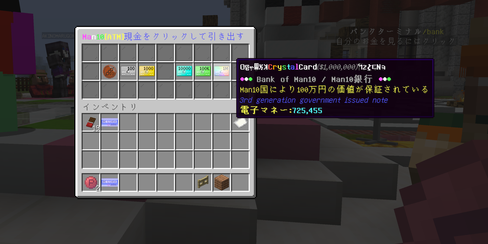
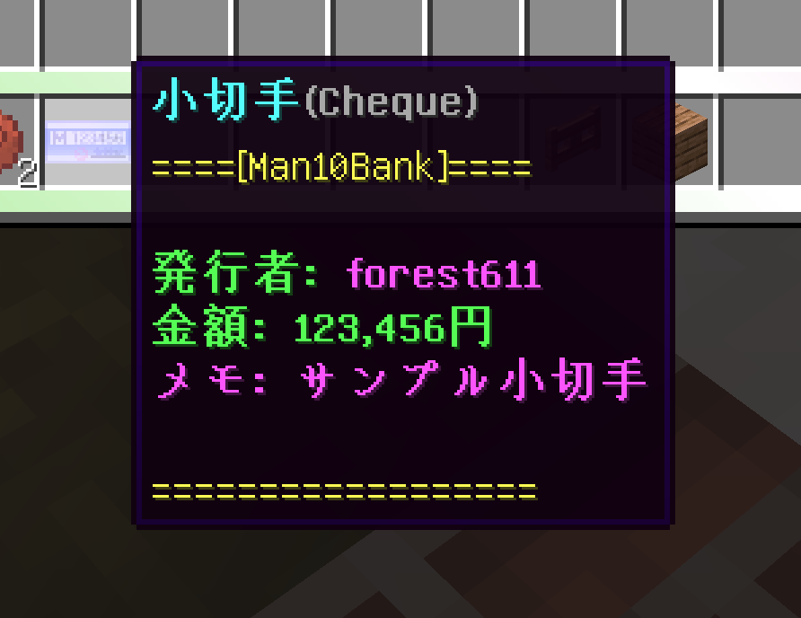

# Man10Bank

Man10サーバー用の総合的な銀行システムプラグインです。オフラインプレイヤーにも対応しており、ATM、小切手、ローンなどの機能を提供します。

## 機能

### 銀行システム
- プレイヤーの残高管理
- プレイヤー間の送金
- 残高ランキング表示
- 取引履歴の記録と表示


**注意**: スクリーンショットに表示されるアイテムやテクスチャはリソースパックのものを使用しています。

### ATMシステム
- インベントリGUIを使用した簡単な操作
- 預金と引き出し
- 残高確認



**注意**: スクリーンショットに表示されるアイテムやテクスチャはリソースパックのものを使用しています。

### 小切手システム
- アイテムとして発行可能な小切手
- メモ機能付き
- 管理者用の特別発行コマンド



**注意**: スクリーンショットに表示されるアイテムやテクスチャはリソースパックのものを使用しています。

### ローンシステム
- プレイヤー間ローン
- サーバーからのローン（リボルビング方式）
- ローン上限額と利率の設定
- ローンランキング表示


**注意**: スクリーンショットに表示されるアイテムやテクスチャはリソースパックのものを使用しています。

## コマンド

### 基本コマンド
- `/bal`, `/balance`, `/money`, `/bank` - 残高確認
- `/mpay <プレイヤー名> <金額>` - プレイヤーに送金
- `/deposit <金額>` - Vaultから銀行に入金
- `/withdraw <金額>` - 銀行からVaultに出金

### ATMコマンド
- `/atm` - ATMを開く

### 小切手コマンド
- `/mcheque <金額> [メモ]` - 小切手を発行（権限必要）
- `/mchequeop <金額> [メモ]` - 管理者用小切手発行（OP権限必要）

### ローンコマンド
- `/mlend` - プレイヤーローンコマンド
- `/mrevo` - サーバーローンシステムコマンド

### 管理者コマンド
- `/mbaltop` - サーバー残高ランキング
- `/mloantop` - サーバーローンランキング
- `/ballog` - 銀行ログ確認

## 権限
- `man10bank.op` - 管理者権限
- `man10bank.use_cheque` - 小切手使用権限
- `man10bank.issue_cheque` - 小切手発行権限

## インストール方法

1. プラグインJARファイルをサーバーの`plugins`フォルダに配置します
2. サーバーを再起動するか、`/reload`コマンドを実行します
3. `config.yml`を必要に応じて編集します
4. MySQLデータベースを設定します

## 設定

`config.yml`で以下の設定が可能です：

```yaml
mysql:
  host: localhost
  user: root
  pass: pass
  port: 3306
  db: man10offlinebank

mlendFee: 0.1        # ローン手数料
mlendMax: 10000000.0 # 最大ローン額
mlendRate: 1.0       # ローン利率
enableLocalLoan: false # ローカルローン有効化

loggingServerHistory: false # サーバー履歴ログ記録
paymentThread: false      # 支払いスレッド

kickDunce: false         # 未払いプレイヤーのキック

isInstalledShop: false   # Man10ShopV2連携

revolving:              # リボルビングローン設定
  lendParameter: 0.0
  borrowStandardScore: 0
  minServerLoan: 100000.0
  maxServerLoan: 1000000.0
  revolvingFee: 0.0
  lastPaymentCycle: 0
  enable: true
  maximumOfLoginTime:
    - '1,000:100,000'
```

## 依存プラグイン

- Vault（必須）
- Man10CommonLibs（オプション）
- Man10Mail（オプション）
- Essentials（オプション）
- Man10Score（オプション）

## ライセンス

このプラグインのライセンスについては、LICENSEファイルを参照してください。

## ローカルデプロイ（開発者向け）

ビルドしたJARをローカルのPaperサーバー `plugins/` ディレクトリへコピーするための手段を用意しています。

- 事前準備: ルートに `.env` を作成してコピー先を設定

```
DEPLOY_DIR=/path/to/your/paper/plugins
```

- 方法1（シェル）: スクリプトでビルド+配布

```
sh ./local-deploy.sh
```

- 方法2（Gradle）: タスクで配布のみ（ビルド済みJarをコピー）

```
gradle deploy
```

- 方法3（Gradle）: ビルド後に自動で配布（オプション）

```
gradle clean build -Pdeploy
# もしくは環境変数で指定
DEPLOY_ON_BUILD=true gradle clean build
```

いずれもコピー先の `plugins/` から既存の `Man10Bank-*.jar` を削除してから新しいJarを配置します。


## 開発者

- [Man10 Project](https://man10.red)

## 画像について

本READMEに使用されている画像内のアイテムやテクスチャは、Man10サーバー専用のリソースパックを使用しています。標準のMinecraftテクスチャとは異なる場合があります。

## 注意事項

- このプラグインはMySQLデータベースを使用します。適切に設定してください。
- サーバーの経済システムに大きな影響を与える可能性があるため、テスト環境での十分な検証をお勧めします。
- バグや問題を発見した場合は、GitHubのIssueで報告してください。
